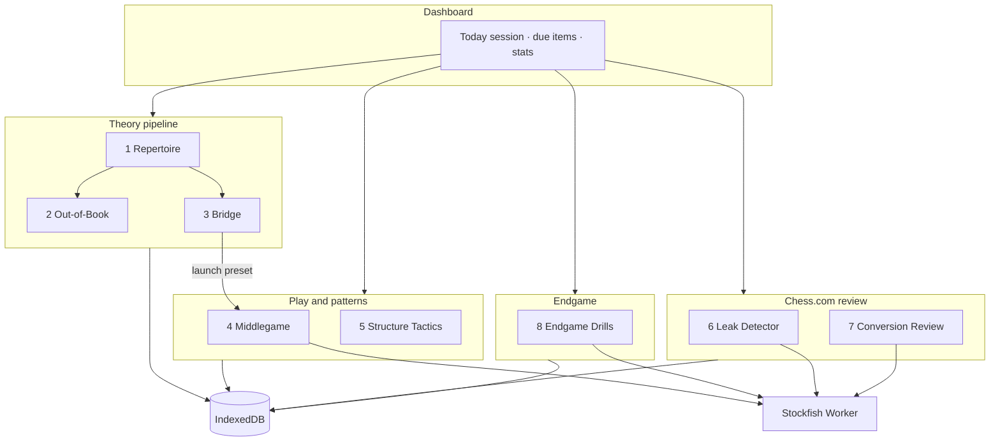

# System Architecture

Chess Training Lab — personal, localhost web app with **eight integrated training modules** spanning repertoire, out-of-book defense, opening-to-middlegame transitions, structure play, themed tactics, Chess.com leak and conversion review, and endgame drills.

**Persistence:** IndexedDB (locked). See [DATA.md](./DATA.md) and [DECISIONS.md](./DECISIONS.md).

---

## 1. Goals and user model

### Training goals

| Gap | Module | Outcome |
|-----|--------|---------|
| No formal QG / Caro plans | Repertoire Trainer | Memorize **intent** and move order for chosen lines |
| Opponents leave your prep | Out-of-Book Defender | Principled responses without memorizing full new lines |
| Opening ≠ middlegame plan | Opening → Middlegame Bridge | Know **what to do** right after your theory ends |
| Weak opening-specific middlegames | Middlegame Simulator | Play from characteristic **pawn structures** (FEN seeds) |
| Random tactics don’t match games | Structure Tactics | Pattern recognition in **your** structures |
| Intuition leaks at ~1600 | Leak Detector + Quiz | Turn Chess.com mistakes into repeatable puzzles |
| Throwing winning games | Conversion Review | Fix **conversion** mistakes, not only blunders |
| Weak endgames | Endgame Drill-Master | High-repetition technique with **strict reset** |

### User profile (baked into content defaults)

- Rating band: ~1500–1700 Rapid
- White: Queen's Gambit family (`1. d4` → `2. c4` systems)
- Black: Caro-Kann (`1... c6` vs `1. e4`)
- Style: intuition-first; content emphasizes `intent` and `plans` text, not deep theory tables

---

## 2. Technology stack

### 2.1 Components

```
┌─────────────────────────────────────────────────────────────┐
│                     Browser (localhost)                      │
├─────────────────────────────────────────────────────────────┤
│  React UI                                                    │
│    react-chessboard  ←→  chess.js (rules, FEN, PGN, UCI)    │
│    Tailwind CSS                                              │
├─────────────────────────────────────────────────────────────┤
│  Hooks / Services (main thread)                              │
│    repertoire · out-of-book · bridge · presets · tactics     │
│    chess.com client · blunder + conversion detectors         │
│    storage repos                                             │
├─────────────────────────────────────────────────────────────┤
│  Web Worker: stockfish.worker.ts                             │
│    stockfish.js (UCI) — analysis + engine opponent           │
├─────────────────────────────────────────────────────────────┤
│  IndexedDB: chess-training-lab                               │
│    settings · repertoire_progress · out_of_book_progress ·   │
│    bridge_progress · drill_stats · tactics_progress ·        │
│    personal_blunders · conversion_missed · analysis_cache    │
├─────────────────────────────────────────────────────────────┤
│  Static JSON: repertoire · out-of-book · bridge · presets · │
│               tactics                                        │
└─────────────────────────────────────────────────────────────┘
         │ fetch (optional)
         ▼
   api.chess.com (public, read-only)
```

### 2.2 Why each piece

| Technology | Role |
|------------|------|
| **Vite** | Fast dev server, ESM, `?worker` imports, dev proxy for Chess.com |
| **React** | Module screens, drill flows, dashboard |
| **Tailwind** | Dense training UI without a component library |
| **chess.js** | Legal moves, SAN/UCI, PGN replay for leak scanning |
| **react-chessboard** | Board UI, orientation, highlights, arrows |
| **stockfish.js + Worker** | Eval, best move, opponent play — off UI thread |
| **IndexedDB** | Durable progress and blunder library between sessions |
| **TypeScript** | Shared types for JSON + IDB records |

### 2.3 Runtime boundaries

- **Main thread:** React, chess.js, IDB I/O, Chess.com `fetch`, job queue orchestration
- **Worker thread:** Stockfish only; communicates via `postMessage` UCI commands
- **No server:** Chess.com calls originate from browser (or Vite proxy in dev)

---

## 3. Application modules

### 3.1 Module map



**Suggested training loop (dashboard):** Repertoire → Out-of-book (linked) → Bridge → Middlegame preset → Tactics pack → Leak/Conversion quizzes → Endgame drill.

### 3.2 Repertoire Builder & Trainer (Module 1)

**Input:** `data/repertoire/queens-gambit-caro-kann.json`  
**Output:** Updates `repertoire_progress` in IDB

**Flow:**

1. User selects side (White QG / Black Caro) and a tree node
2. Board sets FEN at branch start; `pathUci` defines the line
3. User moves: `verifyMove(userUci, expectedUci, aliases?)` → accept or reject
4. On accept: advance ply; if opponent ply exists in tree, auto-play `pathUci[ply]`
5. On reject (strict mode): show `intent` / `plans`; rewind to `branchPoint` or line start per config
6. On line complete: update progress record (streak, `lastPracticedAt`, `status`)

**Engine:** Not used for opponent moves (D-007).

**Links:** Each leaf `nodeId` may reference deviations in `data/out-of-book/` and handoffs in `data/bridge/` via matching IDs.

---

### 3.3 Out-of-Book Defender (Module 2)

**Input:** `data/out-of-book/deviations.json`  
**Output:** `out_of_book_progress` in IDB

**Purpose:** Opponents rarely stay in your main lines. This module trains **principle-based responses**—not a second memorized repertoire.

**Flow:**

1. User picks a deviation tied to a repertoire node (e.g. “vs QGD — …Bb4+”)
2. Board loads `fen` after the opponent’s **deviation move** (one or two plies off book)
3. **Step A — Choose a plan:** User selects one of 2–4 `planChoices` (one `correct: true`); wrong choice shows `feedback` without advancing
4. **Step B — Find the move:** User plays on the board; accepted moves are `acceptableUci[]` (often 1–3 good moves, not one only)
5. Optional **short continuation:** App auto-plays 1–2 `opponentReplies` from JSON; user may play one more approved move
6. Update `out_of_book_progress` (attempts, `status`, `lastPracticedAt`)

**Engine:** Not required for grading (move list is curated). Optional “hint” shows `principle` text.

**Content model:** `parentNodeId` links to repertoire tree; `severity: common | occasional` for dashboard sorting.

---

### 3.4 Opening → Middlegame Bridge (Module 3)

**Input:** `data/bridge/handoffs.json`  
**Output:** `bridge_progress` in IDB

**Purpose:** Close the gap between “I finished theory” and “I know my middlegame plan.”

**Flow:**

1. User selects a **handoff** linked to a completed repertoire line (`repertoireNodeId`)
2. **Recap panel:** Shows last `recapMoveCount` moves (default 4) from `recapSan` / board rewind
3. Board at `handoffFen` (first middlegame position)
4. **Plan quiz:** User picks one `planChoices` card (e.g. “Rc1 + pressure c-file” vs “Immediate e4”); must match `correctPlanId`
5. On success: show `intentSummary` and **`linkedPresetId`**
6. **Continue to middlegame:** Deep-link to `/middlegame` with preset pre-selected (query `?preset=mg-karlsbad-qgd`)
7. Update `bridge_progress` — track `planQuizCorrect`, `continuedToMiddlegame`

**Engine:** Not used in plan quiz. Middlegame step uses Module 4 engine settings.

**Authoring rule:** Every high-priority repertoire leaf should have ≥1 handoff + `linkedPresetId` that matches its structure.

---

### 3.5 Middlegame Position Simulator (Module 4)

**Input:** Presets where `module === "middlegame"`  
**Output:** `drill_stats` (optional session notes)

**Flow:**

1. Pick structure (e.g. Karlsbad, Caro Advance)
2. Load `fen`; set orientation from `sideToTrain`
3. User vs Stockfish (`stockfish` config on preset)
4. `resetOnMistake: false` by default — free play to learn plans
5. `PlansPanel` shows static `plans` from JSON

**Entry points:** Direct from nav; from Bridge via `linkedPresetId`; dashboard “today’s session.”

---

### 3.6 Structure Tactics (Module 5)

**Input:** `data/tactics/structure-tactics.json`  
**Output:** `tactics_progress` in IDB

**Purpose:** Tactical patterns that actually appear in QG/Caro structures—not unrelated puzzle rush.

**Flow:**

1. User picks a **pack** (`packId`: e.g. `qg-c-file`, `caro-c5-break`) or filtered by `structureTag`
2. Board loads puzzle `fen`; side to move from `sideToMove`
3. User plays a move; app checks UCI against `solutionUci` (and `solutionAliasesUci` if present)
4. Wrong: show `themeHint` (not full solution unless user requests reveal); increment attempts
5. Correct: optional link “Related middlegame preset” → Module 4
6. Update `tactics_progress` per `puzzleId`

**Engine:** Optional hint only (`go depth 10` on demand). **Grading is JSON-authoritative** (fast, offline-friendly).

**Puzzle fields:** `theme`, `structureTag`, `difficulty`, `sourceNote` (e.g. “from Karlsbad games”).

---

### 3.7 Chess.com Leak Detector & Quizzer (Module 6)

**Input:** Username from `settings`; monthly archives from API  
**Output:** `personal_blunders` (+ optional `analysis_cache`)

**Flow:**

1. Fetch archive list → download selected months (throttled)
2. Filter games (see §3.5)
3. Replay PGN; at each **user** ply, queue engine job: eval before / after played move
4. If eval swing ≥ threshold → create `PersonalBlunder` document → `put` IDB
5. Quiz UI: show `fen`, side to move, user finds best move; compare to `analysis.bestMove`

**Scan vs quiz depth:**

| Phase | Movetime / depth | Purpose |
|-------|------------------|---------|
| Batch scan | ~300–500 ms | Find candidate leaks quickly |
| Quiz review | depth 16–18 or 1–2 s | Confirm best move for training |

**UI:** Route `/leaks` with tabs: **Queue** | **Quiz** | **Scan** (shared Chess.com fetch status with Module 7).

---

### 3.8 Conversion Review (Module 7)

**Input:** Same Chess.com archives and game filters as Module 6  
**Output:** `conversion_missed` in IDB (+ shared `analysis_cache`)

**Purpose:** Find games where you were **winning** but drew or lost—fix rating leaks from missed conversions, not only blunders.

**Detection (scan pass):**

1. Replay filtered games; track user’s eval after each move (side-normalized)
2. Record **peak eval** `peakEvalCp` while user had advantage (≥ `CONVERSION_MIN_PEAK_CP`, default **+200**)
3. Flag **conversion miss** when:
   - `peakEvalCp >= 200` at some ply, AND
   - Later user move drops eval to ≤ `CONVERSION_DROP_TO_CP` (default **+80**) OR game ends in draw/loss from winning-ish position
4. Save critical moment (usually the **first drop** or **decisive mistake** after peak) as `ConversionMissed`

**Quiz flow:** Same UX as blunder quiz—position at mistake, find better move; prompts emphasize “you were winning—what keeps the advantage?”

**Dashboard:** Separate counts: open blunders vs open conversions.

---

### 3.9 Game filters (Chess.com — Modules 6 & 7)

**White — Queen's Gambit bucket**

- PGN starts with `1. d4` (user played White)
- Optional: require `2. c4` within first 4 plies
- ECO prefix optional secondary filter: `D0`–`D6`

**Black — Caro-Kann bucket**

- PGN starts with `1. e4` and `1... c6` (user played Black)
- ECO prefix optional: `B10`–`B15`

Store `filterMatched` on each blunder and conversion record for dashboard filtering.

**Shared service:** `services/chesscom/` handles fetch, filter, PGN replay; `services/analysis/` exposes `detectBlunder()` and `detectConversionMiss()`.

---

### 3.10 Theoretical Endgame Drill-Master (Module 8)

**Input:** Presets where `module === "endgame"`  
**Output:** `drill_stats` with high `resetCount`

**Flow:**

1. Load preset FEN
2. User moves; after each move, engine evaluates
3. If `sessionDefaults.resetOnMistake` and user move loses ≥ **30 cp** vs engine best → reset board to preset FEN, increment `resetCount`
4. Draw/stalemate when training winning technique → optional reset per `resetOnDraw`
5. Stockfish: `skillLevel: 20`, defender or opponent per `stockfish.role`

---

## 4. State management

### 4.1 Context layers

| Context | Provides |
|---------|----------|
| `AppContext` | `settings` (hydrated from IDB), active route, global errors |
| `EngineContext` | Worker ref, `engineStatus`, `enqueueJob()`, last eval |

### 4.2 Hook responsibilities

| Hook | Responsibility |
|------|----------------|
| `useChessSession` | Single `Chess` instance, move history, FEN sync with board |
| `useStockfish` | Wraps engine queue: `analyze(fen)`, `bestMove(fen, limits)` |
| `useRepertoireTrainer` | Tree navigation, verify pipeline, progress writes |
| `useOutOfBookDrill` | Plan quiz + acceptable-move grading |
| `useBridgeHandoff` | Recap, plan quiz, navigate to middlegame with preset |
| `usePresetSession` | Middlegame/endgame shared session logic |
| `useTacticsDrill` | Puzzle queue, UCI check, hints |
| `useChessComGames` | Archive fetch, filter, shared scan orchestration |
| `useBlunderQuiz` | Leak puzzle attempts, `personal_blunders` updates |
| `useConversionQuiz` | Conversion puzzle attempts, `conversion_missed` updates |
| `usePersistentStore` | Generic IDB hydrate + debounced persist |

### 4.3 Engine job queue (main thread)

```typescript
// Conceptual — implementation in src/services/engine/queue.ts
type EngineJob =
  | { kind: 'analyze'; fen: string; limits: GoLimits; resolve: (result: Analysis) => void }
  | { kind: 'bestMove'; fen: string; limits: GoLimits; resolve: (uci: string) => void };

// FIFO; worker busy flag; cancel token for long scans
```

Worker protocol: UCI strings (`position fen ...`, `go movetime N`, parse `info` / `bestmove`).

---

## 5. IndexedDB architecture (summary)

Full detail: [DATA.md](./DATA.md).

| Store | Key | Purpose |
|-------|-----|---------|
| `settings` | `'app'` | Username, thresholds, UI prefs |
| `repertoire_progress` | `nodeId` | Per-line training stats |
| `out_of_book_progress` | `deviationId` | Out-of-book drill stats |
| `bridge_progress` | `handoffId` | Bridge plan quiz + continuation stats |
| `drill_stats` | `presetId` | Middlegame/endgame aggregates |
| `tactics_progress` | `puzzleId` | Per-puzzle solve stats |
| `personal_blunders` | `id` (UUID) | Leak puzzles |
| `conversion_missed` | `id` (UUID) | Conversion miss puzzles |
| `analysis_cache` | `cacheKey` | Dedupe Chess.com ply analysis |

**Database:** `chess-training-lab`, version `1` (all stores created in Phase 1).

---

## 6. File and folder structure

Target layout when implementation starts:

```
chess-training-lab/
├── README.md
├── docs/                          # ← you are here
├── data/
│   ├── repertoire/
│   │   └── queens-gambit-caro-kann.json
│   ├── out-of-book/
│   │   └── deviations.json
│   ├── bridge/
│   │   └── handoffs.json
│   ├── presets/
│   │   └── structures-and-endgames.json
│   └── tactics/
│       └── structure-tactics.json
├── public/
├── index.html
├── package.json
├── vite.config.ts                 # worker + /api/chesscom proxy
├── tailwind.config.js
├── tsconfig.json
└── src/
    ├── main.tsx
    ├── App.tsx
    ├── index.css
    ├── routes/
    │   ├── index.tsx              # dashboard + today's session
    │   ├── repertoire.tsx
    │   ├── out-of-book.tsx
    │   ├── bridge.tsx
    │   ├── middlegame.tsx
    │   ├── tactics.tsx
    │   ├── leaks.tsx              # leak detector + quiz
    │   ├── conversion.tsx         # conversion review + quiz
    │   └── endgame.tsx
    ├── components/
    │   ├── layout/
    │   ├── board/
    │   ├── repertoire/
    │   ├── out-of-book/
    │   ├── bridge/
    │   ├── middlegame/
    │   ├── tactics/
    │   ├── leaks/
    │   ├── conversion/
    │   └── endgame/
    ├── context/
    │   ├── AppContext.tsx
    │   └── EngineContext.tsx
    ├── hooks/
    ├── workers/
    │   └── stockfish.worker.ts
    ├── services/
    │   ├── chesscom/
    │   ├── analysis/
    │   │   ├── blunderDetector.ts
    │   │   └── conversionDetector.ts
    │   ├── repertoire/
    │   ├── out-of-book/
    │   ├── bridge/
    │   ├── tactics/
    │   └── engine/
    ├── storage/
    │   ├── db.ts
    │   ├── settingsRepo.ts
    │   ├── progressRepo.ts
    │   ├── outOfBookRepo.ts
    │   ├── bridgeRepo.ts
    │   ├── tacticsRepo.ts
    │   ├── blundersRepo.ts
    │   ├── conversionRepo.ts
    │   ├── drillStatsRepo.ts
    │   ├── cacheRepo.ts
    │   └── backup.ts
    ├── types/
    ├── constants/
    └── utils/
```

---

## 7. Cross-cutting concerns

### 7.1 Stockfish in Vite

- Worker entry: `new Worker(new URL('./stockfish.worker.ts', import.meta.url), { type: 'module' })`
- Import `stockfish.js` **inside worker only**
- Init sequence: `uci` → `isready` → respond `readyok` to UI
- Never call Stockfish synchronously on main thread

### 7.2 Chess.com API (localhost)

- Base: `https://api.chess.com/pub/player/{username}/...`
- Vite proxy: `/api/chesscom` → `https://api.chess.com/pub` (rewrite path)
- Throttle: ~300 ms between archive GETs; backoff on HTTP 429
- No API key; respect public API usage

### 7.3 Eval and classification

- Scores normalized to **centipawns** from side-to-move perspective
- **Swing:** `|evalAfterPlayed - evalBefore|` (adjust for mate scores: treat M1 as ±10000 cp)
- Default ingest: `swingCp >= 150`; tag `blunder` if `>= 200`
- Conversion: peak ≥ **+200 cp** (user POV), later drop to ≤ **+80** or game not won (see [DATA.md](./DATA.md))

### 7.4 Error handling (personal bar)

- Failed fetch: show message + retry button
- Worker crash: re-instantiate worker, clear queue, toast "Engine restarted"
- IDB quota exceeded: prompt to export backup and delete old `analysis_cache` entries

---

## 8. Security and privacy

- All data stays on device (IDB + optional JSON backup files you save)
- Chess.com username is stored in IDB only
- No telemetry
- Backup files may contain PGN snippets — treat exports as personal data

---

## 9. Related documents

- [DECISIONS.md](./DECISIONS.md) — locked ADRs
- [DATA.md](./DATA.md) — schemas, IDB upgrade path, backup format
- [IMPLEMENTATION.md](./IMPLEMENTATION.md) — phases 1–8 with test criteria
- [SETUP.md](./SETUP.md) — dev environment, proxy, worker
- [UI.md](./UI.md) — per-route screen specification
- [CONTENT.md](./CONTENT.md) — JSON authoring workflow
- [CHESSCOM.md](./CHESSCOM.md) — API and scan pipeline
- [CONSTANTS.md](./CONSTANTS.md) — thresholds and defaults
- [schemas/examples/](./schemas/examples/) — sample JSON payloads
